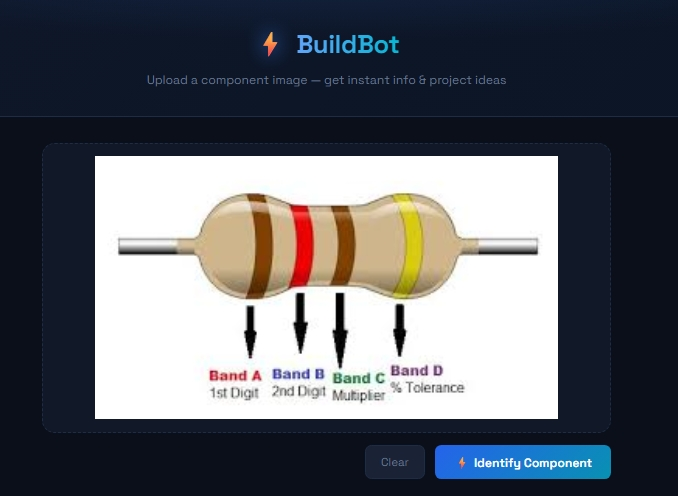
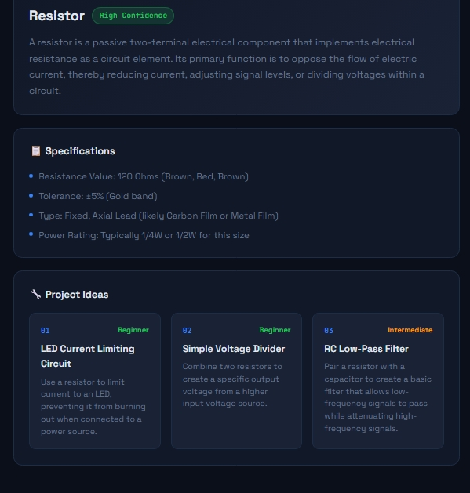
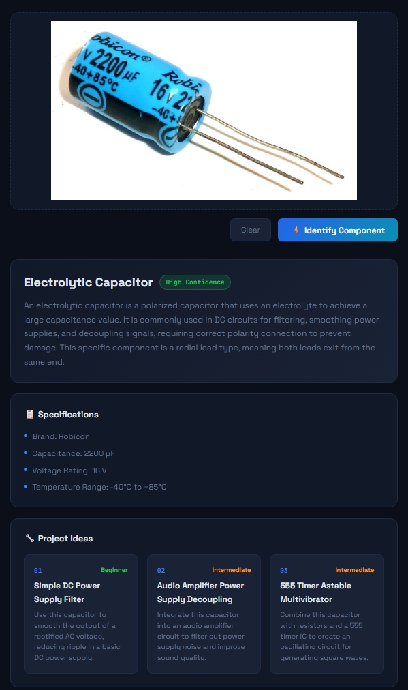

# BuildBot 

AI-powered electronic component detector. Upload an image of any electronic component and instantly get:
- Component name & confidence level
- Specifications
- 3 project ideas with difficulty levels

Powered by **Google Gemini AI** — free, fast, no training needed.

---

## Prerequisites

- [Node.js](https://nodejs.org) (LTS version)
- [Git](https://git-scm.com)
- A free [Gemini API Key](https://aistudio.google.com)

---

## Setup Instructions

### 1. Clone the repository
```bash
git clone https://github.com/your-username/build-bot.git
cd build-bot
```

### 2. Install dependencies
```bash
npm install
```

### 3. Get your Gemini API Key (Free)
1. Go to [aistudio.google.com](https://aistudio.google.com)
2. Sign in with your Google account
3. Click **Get API Key → Create API Key**
4. Copy the key

### 4. Create a `.env` file
In the root of the project folder, create a file named `.env` and add:
```
VITE_GEMINI_API_KEY=your_gemini_api_key_here
```
Replace `your_gemini_api_key_here` with the key you copied.

### 5. Run the app
```bash
npm run dev
```

Open [http://localhost:5173](http://localhost:5173) in your browser.

---

## Folder Structure

```
build-bot/
  src/
    App.tsx       ← Main app component
    main.tsx      ← React entry point
    index.css     ← Styles
  index.html      ← HTML entry point
  package.json    ← Dependencies
  vite.config.ts  ← Vite config
  tsconfig.json   ← TypeScript config
  .env            ← Your API key (never share or push this!)
```

---

## Important — Keep your API key safe

- **Never push `.env` to GitHub**
- Make sure `.env` is listed in your `.gitignore` file
- Each person cloning this repo needs to create their own `.env` with their own free Gemini key

---

## Components it can detect

Resistor, Capacitor, LED, Arduino, Breadboard, Transistor, Diode, IC Chip, Relay, Potentiometer, Inductor, Crystal Oscillator, and many more.

---

## Home Page



## Results 





---
